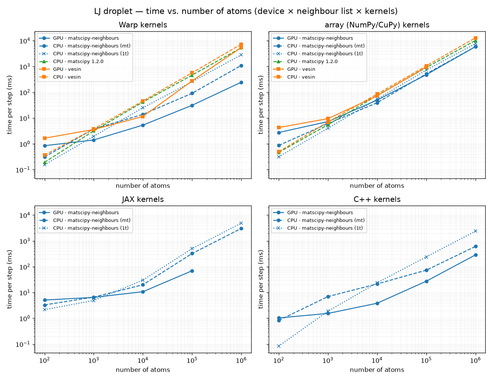

# Benchmark

Per-step wall time of the [Lennard-Jones Langevin droplet](examples.md) example
across droplet sizes, for the full cross-product of **device** (CPU / GPU),
**neighbour list** and **kernels** (Warp / array (NumPy/CuPy) / JAX / C++).
Lower is better. The neighbour-list backends are:

- **matscipy-neighbours** — this library (`matscipy_neighbours`), CPU + GPU;
- **matscipy 1.2.0** — the classic [`matscipy`](https://pypi.org/project/matscipy/)
  package's `neighbour_list`, the CPU reference this library descends from;
- **vesin** — [`vesin`](https://github.com/luthaf/vesin), CPU + GPU.

!!! info "Test machine"
    - **CPU:** Intel(R) Core(TM) Ultra 7 356H (16 logical cores)
    - **GPU:** NVIDIA RTX PRO 500 Blackwell Generation Laptop GPU

!!! warning "CPU threading"
    On the CPU the **matscipy-neighbours** list is benchmarked **both
    single-threaded** (`OMP_NUM_THREADS=1`, the `(1t)` rows) **and
    multi-threaded** (all 16 logical cores, the `(mt)` rows). The C++
    force loop is OpenMP-parallel and follows the same setting; the Warp and
    array kernels and the JAX backend use their own threading. The classic
    **matscipy 1.2.0** and **vesin** CPU lists are single-threaded. The GPU rows
    are unaffected.

!!! note "Empty cells"
    vesin and matscipy 1.2.0 only feed the Warp and array kernels: JAX uses the
    dense `neighbour_matrix` and the C++ example uses the in-tree C++ core, so
    those rows are left empty. matscipy 1.2.0 is CPU-only, so it has no GPU rows.
    A blank in an otherwise-populated row marks a size that **exceeded the GPU
    memory** (e.g. the JAX dense matrix and the CuPy/vesin GPU paths at the
    largest sizes on this card).

Run configuration: reduced LJ units, cutoff 2.5, dt 0.005, friction 1.0,
temperature 0.7; logarithmically spaced sizes (100 → 1000000 atoms).
Up to 40 steps per point (fewer for the largest systems; JAX and Warp are
compiled once during an untimed warm-up).



| Configuration | 100 atoms | 1000 atoms | 10000 atoms | 100000 atoms | 1000000 atoms |
|---|---|---|---|---|---|
| Warp · matscipy-neighbours · GPU | 0.85 | 1.42 | 5.32 | 31.22 | 244.88 |
| Warp · matscipy-neighbours · CPU (mt) | 0.31 | 3.77 | 13.88 | 91.11 | 1093.46 |
| Warp · matscipy-neighbours · CPU (1t) | 0.15 | 1.97 | 25.04 | 256.83 | 2807.42 |
| Warp · matscipy 1.2.0 · CPU | 0.19 | 3.19 | 41.62 | 461.17 | 5314.42 |
| Warp · vesin · GPU | 1.66 | 3.60 | 11.53 | 275.64 | 5426.82 |
| Warp · vesin · CPU | 0.37 | 3.78 | 45.86 | 568.37 | 7309.84 |
| array (NumPy/CuPy) · matscipy-neighbours · GPU | 2.75 | 7.27 | 49.40 | 477.16 | 5858.19 |
| array (NumPy/CuPy) · matscipy-neighbours · CPU (mt) | 0.87 | 6.11 | 39.11 | 518.21 | 5851.86 |
| array (NumPy/CuPy) · matscipy-neighbours · CPU (1t) | 0.32 | 4.02 | 54.21 | 723.14 | 7660.85 |
| array (NumPy/CuPy) · matscipy 1.2.0 · CPU | 0.47 | 5.49 | 74.91 | 907.25 | 10138.81 |
| array (NumPy/CuPy) · vesin · GPU | 4.28 | 9.49 | 72.26 | 946.87 | — |
| array (NumPy/CuPy) · vesin · CPU | 0.49 | 6.96 | 84.99 | 1054.04 | 12846.20 |
| JAX · matscipy-neighbours · GPU | 5.10 | 6.48 | 10.74 | 69.57 | — |
| JAX · matscipy-neighbours · CPU (mt) | 3.30 | 6.63 | 19.96 | 324.35 | 3042.44 |
| JAX · matscipy-neighbours · CPU (1t) | 2.16 | 4.91 | 30.27 | 501.67 | 4883.77 |
| JAX · matscipy 1.2.0 · CPU | — | — | — | — | — |
| JAX · vesin · GPU | — | — | — | — | — |
| JAX · vesin · CPU | — | — | — | — | — |
| C++ · matscipy-neighbours · GPU | 1.03 | 1.54 | 3.83 | 27.39 | 287.22 |
| C++ · matscipy-neighbours · CPU (mt) | 0.83 | 6.95 | 21.49 | 73.30 | 612.11 |
| C++ · matscipy-neighbours · CPU (1t) | 0.08 | 1.88 | 23.79 | 240.28 | 2384.93 |
| C++ · matscipy 1.2.0 · CPU | — | — | — | — | — |
| C++ · vesin · GPU | — | — | — | — | — |
| C++ · vesin · CPU | — | — | — | — | — |

(values are **ms/step**)

How to read it:

- The neighbour-list build dominates the step, so the **list** choice drives the
  scaling: matscipy-neighbours' cell list stays close to linear on both devices,
  the classic matscipy 1.2.0 list is a single-threaded CPU reference, and vesin's
  GPU path falls behind for these large, low-density droplets.
- The **kernel** choice mostly shifts the curve: the fused C++/CUDA and Warp
  kernels avoid materialising per-pair arrays, the array (NumPy/CuPy) path is the
  simplest, and JAX `jit`-compiles a dense masked sum.
- On the CPU, the matscipy-neighbours `(mt)` rows pull away from `(1t)` as the
  system grows; and even single-threaded, matscipy-neighbours `(1t)` is already
  faster than the classic matscipy 1.2.0 and vesin CPU lists.

This page is generated by `examples/lj_langevin/benchmark.py`. Regenerate it on
your own hardware with:

```bash
python examples/lj_langevin/benchmark.py --build build --doc-out docs/benchmark.md
```

For the C++ rows, build with `-DBUILD_EXAMPLES=ON` (and `-DENABLE_CUDA=ON` for
the GPU binary); the other rows need `pip install jax warp-lang vesin muTimer
matscipy==1.2.0` in the interpreter that runs this driver.
