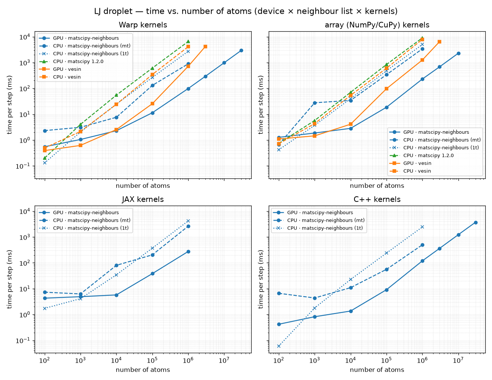

# Benchmark

Per-step wall time of the [Lennard-Jones Langevin droplet](examples.md) example
across droplet sizes, for the full cross-product of **device** (CPU / GPU),
**neighbour list** and **kernels** (Warp / array (NumPy/CuPy) / JAX / C++).
Lower is better. The neighbour-list backends are:

- **matscipy-neighbours** — this library (`matscipy_neighbours`), CPU + GPU;
- **matscipy 1.2.0** — the classic [`matscipy`](https://pypi.org/project/matscipy/)
  package's `neighbour_list`, the CPU reference this library descends from;
- **vesin** — [`vesin`](https://github.com/luthaf/vesin), CPU + GPU.

!!! info "Test machine"
    - **CPU:** AMD EPYC 9655 96-Core Processor (23 usable cores)
    - **GPU:** NVIDIA RTX PRO 6000 Blackwell Server Edition

!!! warning "CPU threading"
    On the CPU the **matscipy-neighbours** list is benchmarked **both
    single-threaded** (`OMP_NUM_THREADS=1`, the `(1t)` curves) **and
    multi-threaded** (all 23 usable cores, the `(mt)` curves). The
    C++ force loop is OpenMP-parallel and follows the same setting; the Warp and
    array kernels and the JAX backend use their own threading. The classic
    **matscipy 1.2.0** and **vesin** CPU lists are single-threaded. The GPU
    curves are unaffected.

!!! note "Missing curves"
    vesin and matscipy 1.2.0 only feed the Warp and array kernels: JAX uses the
    dense `neighbour_matrix` and the C++ example uses the in-tree C++ core, so
    those panels show matscipy-neighbours only. matscipy 1.2.0 is CPU-only, so it
    has no GPU curve. A curve that ends before the largest size either ran
    **out of GPU memory** at the next size (e.g. the JAX dense neighbour
    matrix, or the per-pair arrays of the array kernels) or was stopped because
    its next run was predicted to take longer than
    60 s.

Run configuration: reduced LJ units, cutoff 2.5, dt 0.005, friction 1.0,
temperature 0.7; sizes from 100 to 30,000,000 atoms.
CPU runs stop at 1,000,000 atoms; the GPU runs cover the full range.
Up to 40 steps per point (fewer for the largest systems; JAX and
Warp are compiled once during an untimed warm-up).



How to read it:

- The neighbour-list build dominates the step, so the **list** choice drives the
  scaling: matscipy-neighbours' cell list stays close to linear on both devices
  (on the GPU up to the largest size), the classic matscipy 1.2.0 list is a
  single-threaded CPU reference, and vesin's GPU path grows super-linearly and
  falls far behind for these large, low-density droplets.
- The **kernel** choice mostly shifts the curve: the fused C++/CUDA and Warp
  kernels avoid materialising per-pair arrays, the array (NumPy/CuPy) path is the
  simplest, and JAX `jit`-compiles a dense masked sum.
- On the CPU, the matscipy-neighbours `(mt)` curves pull away from `(1t)` as the
  system grows (at small sizes the thread start-up cost dominates); and from
  about 10⁵ atoms on, even single-threaded matscipy-neighbours `(1t)` is faster
  than the classic matscipy 1.2.0 and vesin CPU lists.

This page is generated by `examples/lj_langevin/benchmark.py`. Regenerate it on
your own hardware with:

```bash
python examples/lj_langevin/benchmark.py --build build --doc-out docs/benchmark.md
```

The raw timings are written to `--results-out` (JSON); pass that file to
`--replot` to redraw the plot and this page without re-running the benchmark.
For the C++ curves, build with `-DBUILD_EXAMPLES=ON` (and `-DENABLE_CUDA=ON` for
the GPU binary); the others need `pip install jax warp-lang vesin muTimer
matscipy==1.2.0 matplotlib` in the interpreter that runs this driver.
