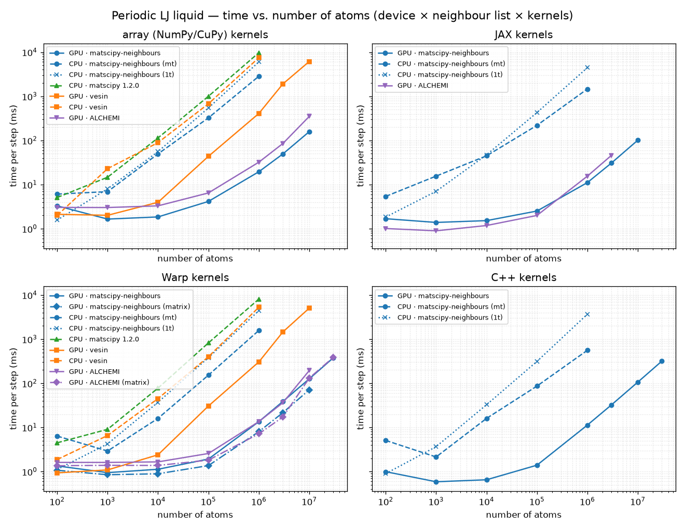
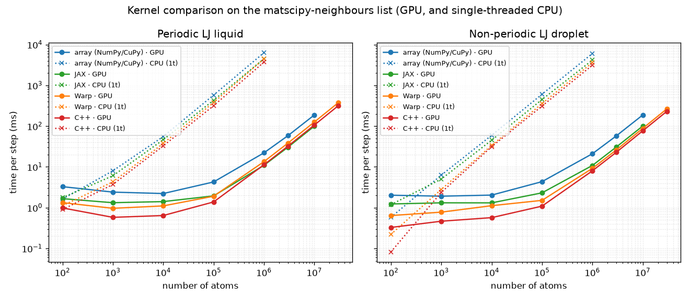
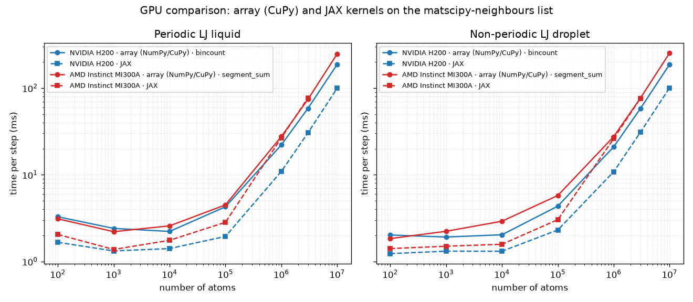

# Benchmark

Per-step wall time of the [Lennard-Jones Langevin](examples.md) example for two
systems — a **bulk liquid in a periodic box** and a **droplet in vacuum**
(non-periodic) — across system sizes, for the full cross-product of **device**
(CPU / GPU), **neighbour list** and **kernels** (Warp / array (NumPy/CuPy) /
JAX / C++). Lower is better. The neighbour-list backends are:

- **matscipy-neighbours** — this library (`matscipy_neighbours`), CPU + GPU;
- **matscipy 1.2.0** — the classic [`matscipy`](https://pypi.org/project/matscipy/)
  package's `neighbour_list`, the CPU reference this library descends from;
- **vesin** — [`vesin`](https://github.com/luthaf/vesin), CPU + GPU;
- **ALCHEMI** — NVIDIA ALCHEMI's
  [`nvalchemiops`](https://github.com/NVIDIA/nvalchemi-toolkit-ops) cell list
  (`method="cell_list"`), GPU only, through its PyTorch interface (Warp and
  array kernels) and its JAX interface (JAX kernel).

!!! warning "What is being measured"
    Every step rebuilds the neighbour list from scratch, and the list is the
    dominant cost of a step here. That is deliberate: these runs are set up to
    expose the neighbour-list performance as much as possible. In a real
    application one would build the list with a Verlet shell (a skin added to
    the cutoff) and reuse it for many steps until an atom has moved half the
    skin, so the total time spent constructing neighbour lists plays a much
    smaller role in the overall cost of a simulation than it does below.

!!! info "Test machine"
    - **CPU:** AMD EPYC 9654 96-Core Processor (23 usable cores)
    - **GPU:** NVIDIA H200

!!! warning "CPU threading"
    On the CPU the **matscipy-neighbours** list is benchmarked **both
    single-threaded** (`OMP_NUM_THREADS=1`, the `(1t)` curves) **and
    multi-threaded** (all 23 usable cores, the `(mt)` curves). The
    C++ force loop is OpenMP-parallel and follows the same setting; the Warp and
    array kernels and the JAX backend use their own threading. The classic
    **matscipy 1.2.0** and **vesin** CPU lists are single-threaded. The GPU
    curves are unaffected.

!!! note "Pair list or neighbour matrix"
    A neighbour list comes in two layouts. The **pair list** is three flat
    arrays `i`, `j`, `S` with one entry per pair; every backend returns it, and
    the array, Warp and C++ kernels run one thread (or array element) per
    pair. The **neighbour matrix** gives each atom a row of fixed capacity
    (here 96 slots) plus a neighbour count; its shapes are static, so the JAX
    kernel uses it, and it is ALCHEMI's native layout (its pair list is
    compacted from the matrix). The Warp panels therefore show the GPU curves
    of matscipy-neighbours and ALCHEMI twice: on the pair list, and on the
    matrix (`(matrix)`, one thread per atom summing its own row). In the matrix
    form both libraries supply the same data — neighbour indices, plus the
    cell shifts in the periodic box (`neighbour_matrix(...,
    quantities="S")`, or `""` for the droplet) — to the same kernel.

!!! note "Missing curves"
    vesin and matscipy 1.2.0 only feed the Warp and array kernels, and ALCHEMI
    the Warp, array and JAX kernels: JAX needs a fixed-capacity neighbour
    matrix, and the C++ example uses the in-tree C++ core. matscipy 1.2.0 is
    CPU-only, and ALCHEMI is benchmarked on the GPU only. A curve that ends
    before the largest size either ran **out of GPU memory** at the next size
    (e.g. the JAX dense neighbour matrix, or the per-pair arrays of the array
    kernels) or was stopped because its next run was predicted to take longer
    than 60 s.

Run configuration: reduced LJ units, cutoff 2.5, dt 0.005, friction 1.0,
temperature 0.7; sizes from 100 to 30,000,000 atoms.
CPU runs stop at 1,000,000 atoms; the GPU runs cover the full range.
Up to 40 steps per point (fewer for the largest systems; JAX and
Warp are compiled once during an untimed warm-up; JAX runs without its
default up-front reservation of GPU memory, which would leave too little for
the neighbour list). Both systems start from an
FCC lattice; the droplet uses lattice constant 1.6, the liquid fills its box at
the stated density.

## Periodic: bulk liquid

A homogeneous liquid at reduced number density 0.8442
in a **fully periodic** cubic box: every grid cell is occupied (dense grid), and
pairs across the boundary carry a non-zero cell shift. At temperature 0.7 the
default density is the Verlet (1967) state point (also the LAMMPS LJ
benchmark's), a liquid at positive pressure well away from coexistence. This is the geometry a
bulk molecular-dynamics or structure-analysis workload sees, and it removes the
vacuum that favours cell lists in the droplet case, so it is the fairer
comparison between the list implementations.



How to read it (on the test machine):

- On the GPU the list build dominates the step for the Warp and C++ kernels,
  which avoid per-pair arrays, and the array kernel adds a roughly constant
  factor on top. The **list** choice therefore drives the scaling. JAX, which
  consumes the neighbour matrix (the faster list to build), is on par with
  the fused kernels.
- In the **matrix** format (the Warp `(matrix)` curves, where both libraries
  supply indices and cell shifts to the same kernel) ALCHEMI is ahead from 10⁶
  to 3×10⁶ atoms (by 10–25%), matscipy-neighbours below 10⁶ atoms and at 10⁷
  atoms (there by almost a factor of two). At 3×10⁷ atoms
  matscipy-neighbours' matrix runs out of GPU memory: its int64 indices and
  shifts take twice the space of ALCHEMI's int32 ones.
- On the **pair list** matscipy-neighbours is ahead below 10⁶ atoms, the two
  are within about 5% from 10⁶ to 3×10⁶, matscipy-neighbours is ahead at 10⁷
  atoms, and only matscipy-neighbours reaches 3×10⁷ atoms, where its pair
  list is also slightly faster than ALCHEMI's matrix.
- In the **JAX** panel matscipy-neighbours' `neighbour_matrix` is faster than
  ALCHEMI's jit-compiled cell list from 10⁵ atoms on and reaches 10⁷ atoms,
  while ALCHEMI runs out of GPU memory above 3×10⁶.
- vesin's GPU path is more than an order of magnitude slower than both at 10⁶
  atoms and grows super-linearly.
- On the CPU, single-threaded matscipy-neighbours `(1t)` is faster than both
  the classic matscipy 1.2.0 and the vesin CPU lists at every size measured.
- Per atom the liquid has more neighbours within the cutoff than the droplet,
  whose surface atoms have fewer, so absolute times are somewhat higher.
- The periodic shifts are folded into the distance vectors by the list (array
  and JAX kernels) or applied from the shift array in the fused kernels (Warp
  and C++), so no kernel wraps positions itself; atoms are free to drift out
  of the box.

## Non-periodic: droplet in vacuum

A self-bound liquid droplet in a **non-periodic**, generously padded box: most
of the cell grid is empty, so this exercises the sparse (hashed) grid and a
list without periodic images.


How to read it (on the test machine):

- matscipy-neighbours scales linearly on the GPU up to the largest size. Its
  neighbour matrix (indices only, as the non-periodic droplet needs no
  shifts) is the fastest GPU list at every size, and its pair list is faster
  than ALCHEMI's pair list at every size.
- ALCHEMI's list build grows super-linearly beyond a few million atoms on this
  sparse geometry: from 3×10⁶ to 10⁷ atoms its build time rises about
  twentyfold for 3.3× the atoms, and its curves end well above
  matscipy-neighbours'.
- vesin's GPU path grows super-linearly and falls far behind for these large,
  low-density droplets.
- On the CPU, single-threaded matscipy-neighbours `(1t)` is faster than the
  classic matscipy 1.2.0 and vesin CPU lists from about 10⁵ atoms on; the
  multi-threaded `(mt)` curves pull away as the system grows (at small sizes
  the thread start-up cost dominates).

## Kernel comparison: the cost of the Lennard-Jones implementation

The figure below keeps the neighbour list fixed — **matscipy-neighbours** on
the GPU, and on the CPU **single-threaded** — and varies only the kernels that
consume it: array (NumPy/CuPy), JAX, Warp and C++/CUDA. Within one device the
array, Warp and C++ curves share the same pair-list build, so the vertical
spread between them is the cost of the potential, not of the list; JAX
consumes `neighbour_matrix` instead, which on the GPU builds faster than the
pair list (see the matrix curves in the Warp panels), so part of JAX's lead
there is the list. This section therefore does
**not** primarily benchmark the neighbour list but the implementation of the
Lennard-Jones potential on top of it:

- the **array** path materialises the per-pair distance vectors returned by the
  list and sums the forces, energies and virials of each atom's contiguous segment of pairs with `segment_sum` (segments from `first_neighbours`; no atomics), which also returns the totals;
- **JAX** `jit`-compiles a dense masked sum over the fixed-capacity
  `neighbour_matrix` (no scatter, but padded rows);
- **Warp** and **C++/CUDA** run one fused pass over the `ij` pairs (plus the
  shift `S` in the periodic box) that recomputes each distance and never
  materialises per-pair arrays; on the GPU the potential energy is reduced
  within each thread block and added with one atomic per block.



The C++ force loop is OpenMP-parallel and honours the single-thread setting;
the NumPy, Warp-CPU and JAX-CPU kernels use their own threading and are not
pinned to one core, so on the CPU the comparison is indicative rather than
strict.

## GPU comparison: array and JAX kernels across GPUs

The array (CuPy) and JAX kernels run unchanged on NVIDIA (CUDA) and AMD (ROCm)
GPUs, so they can compare GPUs directly. The figure below shows both kernels on
the matscipy-neighbours GPU list (pair list for the array kernels,
`neighbour_matrix` for JAX) on each GPU measured so far:

- **NVIDIA H200** (host CPU: AMD EPYC 9654 96-Core Processor (23 usable cores))
- **AMD Instinct MI300A** (host CPU: AMD Instinct MI300A Accelerator (23 usable cores))
- **NVIDIA RTX PRO 6000 Blackwell Server Edition** (host CPU: AMD EPYC 9655 96-Core Processor (23 usable cores))



How to read it:

- The array kernels of all runs sum the pair forces, energies and virials per
  atom with `segment_sum`, without atomics, and get the totals with them. The
  earlier scheme, a weighted `bincount` per component plus full reductions for
  the energy and virial, took 700 ms per step at 10⁶ atoms on the MI300A
  (`segment_sum`: 28 ms) and 22 ms on the H200 (`segment_sum`: 20 ms).
- On the **AMD Instinct MI300A** (ROCm 6.4, JAX 0.4.35 from AMD's ROCm wheels,
  CuPy 13.6 built from source) both kernels are on par with the H200 up to
  10⁴ atoms, where launch latency dominates. At 10⁶ atoms the array kernel
  takes 28 ms per step (H200: 20 ms) and JAX 26 ms (H200: 11 ms); at 10⁷
  atoms the array kernel takes 250 ms (H200: 160 ms).
- On the MI300A, JAX runs out of memory at 10⁷ atoms and the array kernel at
  3×10⁷: plain device allocations reach only the ~63 GiB coarse-grained window
  of the 128 GB of HBM the APU shares with its CPUs, and the neighbour matrix
  alone needs 31 GB at 10⁷ atoms. The H200 (141 GB) runs JAX at 10⁷ atoms.

## Performance portability: NVIDIA and AMD

The same source runs on NVIDIA (CUDA) and AMD (ROCm) GPUs, but code that is
fast on one is not automatically fast on the other. Bringing the MI300A runs
in line with the H200 ones surfaced the following, roughly in order of impact;
the numbers are for the periodic liquid at 10⁶ atoms (5.4×10⁷ pairs) on the
MI300A.

**Caching allocators behave differently.** The library allocates its outputs
afresh on every call, so it relies on a caching allocator. On CUDA the
stream-ordered memory pool (`cudaMallocFromPoolAsync` with an unlimited
release threshold) splits and reuses freed blocks as intended. ROCm 6.4's pool
did not reliably hand freed blocks back: small requests took the large cached
blocks, and whether a block was reused varied from run to run. Every miss maps
fresh memory, at 40–150 ms for the gigabyte-sized outputs, and the pair list
took 160 ms to build instead of 20 ms. On HIP the library therefore keeps its
own cache of `hipMalloc` blocks, in free lists by size, with requests rounded
up to one of eight sizes per power of two.

**A scatter is not the best per-atom sum, and some are pathological.** A
per-atom sum over pairs is usually written as a scatter: a weighted
`bincount`, `cupyx.scatter_add` or `jax.ops.segment_sum`. On the MI300A
CuPy's weighted `bincount` took about 145 ms per component (440 ms for the
forces). The float64 atomics are not to blame: `cupyx.scatter_add` of the same
forces takes 4.6 ms, and a raw `atomicAdd(double)` kernel is as fast. The time
goes into the input validation that `bincount` runs first, `(x < 0).any()`
and `max(x)`, two of CuPy's slow full reductions on ROCm (see the next
paragraph). JAX's `segment_sum` took 1.8 s, even with
`indices_are_sorted=True`. The list is a *full* list, so no scatter is
needed: the pairs of an atom are one contiguous segment, `first_neighbours`
gives the segment starts (on the GPU for device input), and the library's
`segment_sum` sums each segment without atomics, in a fixed order (so results
are reproducible bit for bit): 0.55 ms for the (5.4×10⁷, 3) forces, about
2.4 TB/s and 8× faster than the atomic scatter. `mabincount` offers the same
with matscipy's signature, for sorted indices. The best kernel shape is itself hardware dependent: a group of lanes
per atom and value, reading about 8–12 consecutive values together, was 3×
faster than one thread per atom on the MI300A; the group size is chosen from
that rule and the mean segment length, tuned on the MI300A (wave64) and still
to be checked on NVIDIA (warp32). The neighbour-matrix format avoids the
scatter by construction, since each atom sums its own row; this is how the
JAX kernel works.

**Library defaults differ between backends.** CuPy accelerates reductions with
CUB by default on CUDA, but not on ROCm (`CUPY_ACCELERATORS` defaults to
`cub` and to empty, respectively). Without it a full reduction such as
`x.sum()` over 5.4×10⁷ elements takes about 80 ms on the MI300A instead of
0.2 ms. Such reductions made up nearly all of the array kernel's step: 700 ms
with three `bincount` calls (two reductions each) plus the energy and the
virial, still 190 ms with the energy and the virial alone, and 28 ms once
`segment_sum(..., total=True)` returned the totals with the per-atom sums.
Enabling CUB on ROCm is not a fix: in the CuPy 13.6 build used here,
`sum(axis=1)` then returned wrong results for 2²⁴ rows and more, and
`bincount` failed to compile (CuPy's JIT CUB kernels include its bundled CUDA
headers). CuPy's `add.reduceat` is built from a cumulative sum over all
elements, which costs a temporary of the input's size (13 GB at 10⁷ atoms) and
some accuracy.

**Status in CuPy's issue tracker** (as of October 2026). The ROCm default was
introduced with CUB-by-default in
[cupy#6549](https://github.com/cupy/cupy/pull/6549), without a stated reason
for leaving HIP out; no issue reports the slow generic reductions on ROCm, and
[cupy#9657](https://github.com/cupy/cupy/pull/9657) (open) would add
hipTensor as a reduction accelerator on HIP. No issue reports the wrong CUB
axis reductions on HIP; the closest are CUDA bugs in the CUB path for large
arrays ([cupy#9186](https://github.com/cupy/cupy/issues/9186),
[cupy#9780](https://github.com/cupy/cupy/issues/9780), fixed by
[cupy#9867](https://github.com/cupy/cupy/pull/9867)), and
[cupy#9940](https://github.com/cupy/cupy/pull/9940) (open) notes that hipCUB
errors were silently discarded. Nothing is reported on the slow
`bincount` on ROCm (a consequence of the slow reductions) or on
`add.reduceat`'s temporary. ROCm 6.x wheels were
planned in [cupy#8606](https://github.com/cupy/cupy/issues/8606), which was
superseded by the ROCm 7 issue
[cupy#9529](https://github.com/cupy/cupy/issues/9529).

**Unified memory on an APU has its own limits.** The MI300A's CPUs and GPU
share 128 GB of HBM, but plain device allocations (`hipMalloc`, and the pools
built on it by the library, CuPy and JAX) reach only a coarse-grained window
of about 63 GiB. Runs that fit easily on the 141 GB H200 run out of memory
there. Managed memory (`hipMallocManaged`) reaches the whole HBM, but the HIP
runtime then performs device-to-device `hipMemcpy` on the host CPU, so copies
should be done with kernels instead. The CPU and the GPU also share the
memory bandwidth, so load from other processes on the node can show up in the
timings.

**Getting the software stack right takes care.** The JAX ROCm plugins on PyPI
are built for other ROCm versions (`libamd_comgr.so.2` versus ROCm 6.4's
`.so.3`); AMD's wheels from `repo.radeon.com` for the installed ROCm release
work. There are no CuPy wheels for ROCm 6.x, so CuPy is built from source
(`CUPY_INSTALL_USE_HIP=1`, `HCC_AMDGPU_TARGET=gfx942`). CuPy compiles each
kernel on first use and caches it on disk, which on ROCm took long enough to
inflate a first run several-fold, so the cache should be warmed before timing.

This page is generated by `examples/lj_langevin/benchmark.py`. Regenerate it on
your own hardware with:

```bash
python examples/lj_langevin/benchmark.py --build build --doc-out docs/benchmark.md
```

The raw timings are written to `--results-out` (JSON); pass that file to
`--replot` to redraw the plots and this page without re-running the benchmark
(the kernel-comparison figure is drawn from the same results). `--systems
liquid` or `--systems droplet` restricts the run to one system. For
the C++ curves, build with `-DBUILD_EXAMPLES=ON` (and `-DENABLE_CUDA=ON` for
the GPU binary); the others need `pip install jax warp-lang vesin muTimer
matscipy==1.2.0 matplotlib nvalchemi-toolkit-ops` and a CUDA build of PyTorch
(for ALCHEMI) in the interpreter that runs this driver.

To add another GPU to the GPU comparison, run only the array and JAX kernels on
it and store them in the existing results file (its main results stay as they
are; the plots and this page are redrawn from the merged file):

```bash
python examples/lj_langevin/benchmark.py --build build \
    --devices gpu --lists matscipy --kernels array jax \
    --sizes 100 1000 10000 100000 1000000 3000000 10000000 30000000 \
    --add-machine docs/benchmark_results.json --doc-out docs/benchmark.md
```

On an AMD GPU this needs a HIP build (`-DENABLE_HIP=ON`) and the ROCm builds of
CuPy and JAX.
