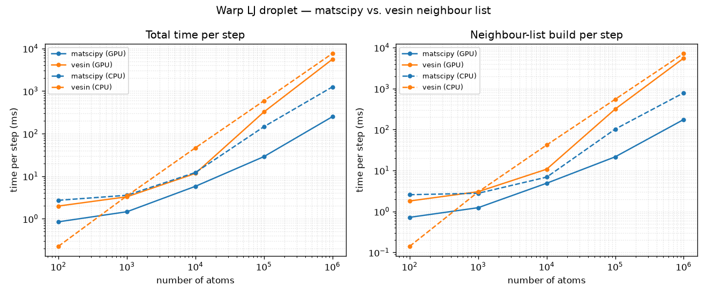

# Warp benchmark — matscipy vs. vesin neighbour list

Per-step wall time of the [Warp Lennard-Jones Langevin droplet](examples.md)
(`lj_langevin_warp.py`) across droplet sizes. The Warp kernels (LJ force +
Langevin integrate) are identical in every run; only the **neighbour-list
builder** changes — this library's `matscipy_neighbours` or
[`vesin`](https://github.com/luthaf/vesin) — so the difference is the list, not
the physics. Lower is better.

!!! info "Test machine"
    - **CPU:** Intel(R) Core(TM) Ultra 7 356H (16 logical cores)
    - **GPU:** NVIDIA RTX PRO 500 Blackwell Generation Laptop GPU

!!! warning "CPU threading"
    The **matscipy** neighbour list is **multi-threaded** (OpenMP, uses all
    16 logical cores). **vesin**'s CPU neighbour list is
    **single-threaded**. The Warp force/integrate kernels are multi-threaded on
    the CPU. Re-run with `OMP_NUM_THREADS=1` for a single-threaded comparison.
    The GPU rows are not affected.

Run configuration: reduced LJ units, cutoff 2.5, dt 0.005, friction 1.0,
temperature 0.7; logarithmically spaced droplet sizes (100 → 1,000,000 atoms).
Up to 40 steps per point (fewer for the largest systems), Warp kernels
compiled once during an untimed warm-up. Each timed phase synchronises the
device, so the reported total is the sum of the phase breakdown. (The matscipy
GPU list itself was verified to build for multi-million-atom droplets — the
limit on this 6 GB card is host/device memory, not the algorithm.)



## Total time per step (ms)

| Implementation | 100 atoms | 1000 atoms | 10000 atoms | 100000 atoms | 1000000 atoms |
|---|---|---|---|---|---|
| matscipy (GPU) | 0.85 | 1.46 | 5.79 | 28.86 | 250.52 |
| vesin (GPU) | 1.99 | 3.29 | 11.65 | 323.48 | 5593.66 |
| matscipy (CPU) | 2.72 | 3.57 | 12.24 | 145.61 | 1254.87 |
| vesin (CPU) | 0.23 | 3.46 | 46.50 | 592.29 | 7649.10 |

## Neighbour-list build per step (ms)

| Neighbour list | 100 atoms | 1000 atoms | 10000 atoms | 100000 atoms | 1000000 atoms |
|---|---|---|---|---|---|
| matscipy (GPU) | 0.719 | 1.237 | 4.892 | 21.528 | 175.293 |
| vesin (GPU) | 1.802 | 3.039 | 10.765 | 315.719 | 5513.652 |
| matscipy (CPU) | 2.567 | 2.778 | 6.893 | 102.294 | 785.560 |
| vesin (CPU) | 0.141 | 2.997 | 41.919 | 547.777 | 7185.723 |

How to read it:

- The neighbour-list build dominates the step for both builders, so it sets the
  overall scaling — which is exactly why the list implementation matters.
- On the **GPU**, `matscipy_neighbours` builds the list with a cell list and
  stays close to linear in the atom count. `vesin`'s GPU path is considerably
  slower for these large, low-density droplets.
- On the **CPU**, matscipy is OpenMP-parallel while vesin is single-threaded, so
  the gap widens with system size; set `OMP_NUM_THREADS=1` to compare like
  for like.

This page is generated by `examples/lj_langevin/benchmark_warp.py`. Regenerate
it on your own hardware with:

```bash
python examples/lj_langevin/benchmark_warp.py --doc-out docs/benchmark_warp.md
```
